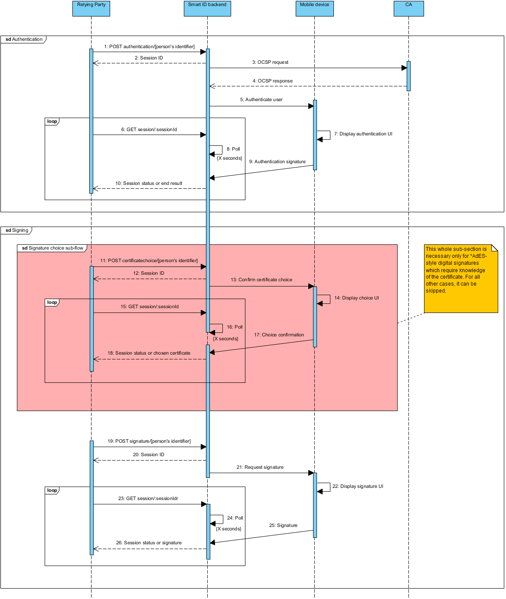

## Table of Contents

* [1 Introduction](#1-introduction)
  * [1.1 Glossary](#11-glossary)
  * [1.2. References](#12-references)
* [2 External API specifications](#2-external-api-specifications)
  * [2.1 Generic interface patterns](#21-generic-interface-patterns)
    * [2.1.1 HTTP status codes](#211-http-status-codes)
    * [2.1.2 Timestamp encoding](#212-timestamp-encoding)
  * [2.2 Relying Party REST interface](#22-relying-party-rest-interface)
    * [2.2.1 REST interface patterns](#221-rest-interface-patterns)
    * [2.2.2 UUID encoding](#222-uuid-encoding)
    * [2.2.3 Interface authentication](#223-interface-authentication)
    * [2.2.4 relyingPartyName handling](#224-relyingpartyname-handling)
    * [2.2.5 Hash algorithms](#225-hash-algorithms)
    * [2.2.6 RP API endpoint authentication](#226-rp-api-endpoint-authentication)
    * [2.2.7 Session management](#227-session-management)
    * [2.2.8 Delay API call until user has seen verification code](#228-delay-api-call-until-user-has-seen-verification-code)
    * [2.2.9 RP must ignore unknown names (fields) in JSON response object](#229-rp-must-ignore-unknown-names-fields-in-json-response-object)
  * [2.3 Relying Party REST API version 2](#23-relying-party-rest-api-version-2)
    * [2.3.1 RP API version 2 changes compared to version 1](#231-rp-api-version-2-changes-compared-to-version-1)
    * [2.3.2 REST object references](#232-rest-object-references)
      * [2.3.2.1 private/:issuer/:encoded-identifier](#2321-privateissuerencoded-identifier)
      * [2.3.2.2 etsi/:semantics-identifier](#2322-etsisemantics-identifier)
      * [2.3.2.3 document/:documentnumber](#2323-documentdocumentnumber)
    * [2.3.3 HTTP status code usage](#233-http-status-code-usage)
    * [2.3.4 Response on successful session creation](#234-response-on-successful-session-creation)
    * [2.3.5 Idempotent behaviour](#235-idempotent-behaviour)
    * [2.3.6 Request properties](#236-request-properties)
    * [2.3.7 Allowed interactions order](#237-allowed-interactions-order)
      * [2.3.7.1 Example allowedInteractionsOrder elements](#2371-example-allowedinteractionsorder-elements)
    * [2.3.8 Certificate choice session](#238-certificate-choice-session)
      * [2.3.8.1 Preconditions](#2381-preconditions)
      * [2.3.8.2 Postconditions](#2382-postconditions)
    * [2.3.8.3 Error conditions](#2383-error-conditions)
      * [2.3.8.4 Request parameters](#2384-request-parameters)
      * [2.3.8.5 Example response](#2385-example-response)
    * [2.3.9 Authentication session](#239-authentication-session)
      * [2.3.9.1 Preconditions](#2391-preconditions)
      * [2.3.9.2 Postconditions](#2392-postconditions)
      * [2.3.9.3 Error conditions](#2393-error-conditions)
      * [2.3.9.4 Request parameters](#2394-request-parameters)
      * [2.3.9.5 Example response](#2395-example-response)
    * [2.3.10 Signing session](#2310-signing-session)
      * [2.3.10.1 Preconditions](#23101-preconditions)
      * [2.3.10.2 Postconditions](#23102-postconditions)
      * [2.3.10.3 Error conditions](#23103-error-conditions)
      * [2.3.10.4 Request parameters](#23104-request-parameters)
      * [2.3.10.5 Example response](#23105-example-response)
    * [2.3.11 Session status](#2311-session-status)
      * [2.3.11.1 Preconditions](#23111-preconditions)
      * [2.3.11.2 Postconditions](#23112-postconditions)
      * [2.3.11.3 Error conditions](#23113-error-conditions)
      * [2.3.11.4 Response structure](#23114-response-structure)
      * [2.3.11.5 Session status end result codes](#23115-session-status-end-result-codes)
    * [2.3.12 Authentication/Signing protocol usage](#2312-authenticationsigning-protocol-usage)
      * [2.3.12.1 Sending authentication request](#23121-sending-authentication-request)
      * [2.3.12.2 Computing the verification code](#23122-computing-the-verification-code)
      * [2.3.12.3 Verifying the authentication response](#23123-verifying-the-authentication-response)
* [3 Use Case realization models](#3-use-case-realization-models)
  * [3.1 UC-X Interaction choice realization](#31-uc-x-interaction-choice-realization)

# 1 Introduction

This document describes the relying party service interface protocol of Smart-ID server and
provides information for integration. The interface offers the entry point to Smart-ID main use
cases, i.e. authentication and signing.

The interface is to be used by relaying parties - parties who wish to use Smart-ID services,
i.e. ask end users to perform authentication and signing operations.

## 1.1 Glossary

* Smart-ID account - A person has to register a Smart-ID account to use services provided by the Smart-ID
system. Account binds a Smart-ID app instance (installed on a person's mobile device)
to a person's identity in the Smart-ID system. In the course of account creation and
registration, the identity of the account owner (person) is proofed by a Registration
Authority (RA) and the relation between the identity and a key pair is certified by a
Certificate Authority (CA). An account has a signature key pair and an authentication
key pair.
* Smart-ID app - A technical component of the Smart-ID system. A mobile app instance installed on a
person's mobile device that provides access to Smart-ID functionality for persons.
* Smart-ID provider - An organization that is legally responsible for the Smart-ID system.
* Smart-ID server - A technical component of the Smart-ID system. Server-side counterpart of the Smart-ID
app. Handles backend operations and provides API-s to Relying Party (RP).
* Smart-ID system - A technical and organizational environment, which enables digital authentication and
issuing of digital signatures of persons in an electronic environment. The Smart-ID
system provides services that allow persons (Smart-ID account owners) to authenticate
themselves to RPs, to give digital signatures requested by RPs, and to manage their
Smart-ID accounts.
* Authentication key pair (or authentication key) - Key pair, which is used to digitally authenticate a person.
* Certificate Authority (CA) - An entity that issues certificates for Smart-ID account owners.
* Key pair - Pair of keys, which are required for digital signature scheme. There are two kinds of key
pairs (or shortly, keys) in the Smart-ID system, authentication key pair and signature key
pair. The word pair refers to to the private and public keys of each key pair used in an
assymetric cryptographic algorithm, here RSA.
* Mobile device - A tablet computer or smartphone that runs a mobile device operating system (Apple iOS,
Google Android).
* Person - A natural person who uses the Smart-ID system to authenticate herself to an RP and to
issue digital signatures requested by RP.
* Registration Authority (RA) - An entity responsible for recording or verifying some or all of the information (particularly
the identities of subjects) needed by a CA to issue certificates and CRLs and to perform
other certificate management functions.
* Relying Party (RP) - An organization or service, for example a bank, which is using the Smart-ID service to
authenticate its users and to get them to sign the documents.
* Relying Party request - A request from an RP that requires some kind of operation in the Smart-ID backend
system. It may or may not create a transaction.
* Signature key pair (or signature key) - Key pair, which is used to give digital signatures of a person.


## 1.2. References

* **ETSI319412-1** ETSI. Electronic Signatures and Infrastructures (ESI); Certificate Profiles;
Part 1: Overview and common data structures. 2015. URL: <http://www.etsi.org/deliver/etsi_en/319400_319499/31941201/01.01.00_30/en_31941201v010100v.pdf>.
* **rfc2616** R. Fielding et al. Hypertext Transfer Protocol – HTTP/1.1. RFC 2616 (Draft Standard).
Obsoleted by RFCs 7230, 7231, 7232, 7233, 7234, 7235, updated by RFCs 2817, 5785,
6266, 6585. Internet Engineering Task Force, June 1999. URL: <https://tools.ietf.org/html/rfc2616>.
* **rfc4122** P. Leach, M. Mealling, and R. Salz. A Universally Unique IDentifier (UUID) URN
Namespace. RFC 4122 (Standards Track). Internet Engineering Task Force, July 2005.
URL: <https://tools.ietf.org/html/rfc4122>.
* **rfc4648** S. Josefsson. The Base16, Base32, and Base64 Data Encodings. RFC 4648
(Proposed Standard). Internet Engineering Task Force, Oct. 2006. URL: <https://tools.ietf.org/html/rfc4648>.


# 2 External API specifications

## 2.1 Generic interface patterns

### 2.1.1 HTTP status codes

There are two custom HTTP status codes that must be handled by all parties communicating
with Smart-ID server.

* **480** - The client is too old and not supported any more.
* **580** - System is under maintenance, retry again later.

### 2.1.2 Timestamp encoding

All timestamps in external interfaces are given using ISO 8601 notation with time zone and
with at least one-second precision.

## 2.2 Relying Party REST interface

This section describes Relying Party REST interface and some requirements for its use. The
detailed API description is found in the section [2.3 Relying Party REST API version 2](#23-relying-party-rest-api-version-2).

The interface is to be used by all parties who wish to consume Smart-ID services, i.e. ask
end users to perform authentication and signing operations.

The main Smart-ID use case is of a relying party to start a transaction by calling the Smart-
ID server RP API with the user's identifier and a hash when the user wishes to authenticate
with the relying party's service or create a signature.

The Smart-ID server then sends a push message notification to the user's device where
the user opens the Smart-ID application, checks the details and enters a PIN code.

The application communicates with the Smart-ID server and once the final signature is
created makes it available for the relying party.

Meanwhile the relying party has been waiting for a reply from the Smart-ID server using a
long poll connection. In case of success it receives the signed hash and the user's certificate
to be able to validate the result.

The Smart-ID server only accepts hashes to be signed. For document signing the relying
party must create the required document structure, calculate the hash and have only that
signed using this RP API.

Technically authentication and signing are very similar, the difference is in the key (and its
certificate) used. For authentication the hash to be signed should be generated randomly by
the relying party service while for signing the hash is calculated from the content to be signed.



### 2.2.1 REST interface patterns

Relying Party API is exposed over a REST interface as described below.
All messages are encoded using `UTF-8`. All requests only support `HTTP/1.1`, as
described in **rfc2616**.

### 2.2.2 UUID encoding

UUID values are encoded as strings containing hexadecimal digits, in canonical 8-4-4-4-12
format, i.e. `de305d54-75b4-431b-adb2-eb6b9e546014`. These are version 4 (random)
UUID values as per **rfc4122**.

### 2.2.3 Interface authentication


Interface users are authenticated based on their originating IP-address
and `relyingPartyUUID` protocol parameter combinations.

When authentication fails, server responds with HTTP error `401`.

### 2.2.4 relyingPartyName handling

`relyingPartyName` request field is case insensitive, must match one of the names
configured for the calling RP. The names are limited to 32 bytes in UTF-8 encoding.

### 2.2.5 Hash algorithms

Smart-ID supports signature operations based on SHA-2 family of hash algorithms, namely
SHA-256, SHA-384 and SHA-512. Their corresponding identifiers in APIs are `SHA256`,
`SHA384` and `SHA512`.

### 2.2.6 RP API endpoint authentication

It is essential that RP performs all the required checks when connecting to the Smart-ID RP
API HTTPS endpoint, to make sure that the connection endpoint is authentic and that the
connection is secure. This is required to prevent Man-in-the-middle (MITM) attacks for the
authentication and signature protocols.

The RP must perform the following checks:

1. Verify the HTTPS connection and the TLS handshake is performed with a secure TLS
ciphersuite.
2. Verify the X.509 certificate of the HTTPS endpoint belongs to the well-known public key
of the Smart-ID API. The RP must implement HTTPS key (or certificate) pinning.
3. Verify the X.509 certificate of the HTTPS endpoint is valid (not expired, signed by trusted
CA and not revoked)

In case the RP fails to verify the connection is genuine and secure the attacker is able to
launch a MITM attack on the connection and circumvent and login as the user instead or have
the user sign a forged document. The following attack is then possible:

1. End user connects to the RP website and asks for Smart-ID authentication method to log
in.
2. RP connects to the authentication API endpoint, but attacker is able to MITM the
connection and answer himself.
3. RP sends the correctly formed authentication request with randomly generated hash `h1`
to the attacker, acting as the Smart-ID RP API.
4. The attacker creates another connection to the RP website and asks for the
authentication using Smart-ID service, under the identity of same end user.
5. RP connects to the authentication API endpoint, but attacker is able MITM the connection
and answer himself.
6. RP sends the correctly formed authentication request with randomly generated hash `h2`
to the attacker, acting as the Smart-ID RP API.
7. Attacker computes the VC values for both hashes, i.e.
  -    `vc1 = integer(SHA256(h1)[-2:-1]) mod 10000`
  -    `vc2 = integer(SHA256(h2)[-2:-1]) mod 10000`
8. If the `vc1!=vc2`, the attacker drops the connection to the RP website and creates a new
one. The connections are tried until the randomly generated hash value yields the same
VC value as the `vc1`. On average it should take about 5000 tries until such a collision is
found.
9. The attacker sends the authentication request with the hash value `h2` to the Smart-ID
authentication RP API endpoint.
10. Smart-ID sends the authentication request to the end user's mobile device and asks to
verify the VC.
11. End user compares the `vc1` displayed on the browser to the `vc2` displayed on the mobile
device and finds that they are equivalent and consents to the authentication.
12. Attacker receives the authentication response from the Smart-ID RP API and returns this
to the RP connected, associated with the attacker's session.
13. RP receives the authentication response with the signature on the hash `h2`, verifies that
the signature is valid and creates authenticated session for the attacker, under the end
user identity.
14. The attacker is logged in as the end user.

### 2.2.7 Session management

Base of all operations on the API is a session, which is internally tracked as Relying Party
request.

A session is created using one of the POST requests listed below and it ends when a result
is created or when an error is encountered.

A session is identified by a server generated random identifier (UUID v4).

Session is created for one of the three operations:

* Authentication
* Signing certificate choice (needed for certain digital signature schemes, see below)
* Signing

Session result can be obtained using a GET request as described in [2.3.11](#2311-session-status).

### 2.2.8 Delay API call until user has seen verification code
When Smart-ID is used to perform a transaction on the same device it is installed on (browser
or RP app) the push notification can arrive quickly and bring the Smart-ID app into the
foreground before the user has had a chance to read the verification code presented by the
RP.

This is especially pronounced in the Verification Code Choice scenario as the user will not
know the correct code when prompted to choose it. The exact behavior depends on mobile
device operating system version, screen state, app permissions and app configuration.

To give the user time to read the verification code the RP should delay issuing the RP API
call a few seconds. It is up to the RP to decide on the exact timing.

### 2.2.9 RP must ignore unknown names (fields) in JSON response object

The Smart-ID service reserves the right to add new fields into responses of the current RP API
version. Therefore the RP must ignore unknown names (fields) in JSON response objects at
any location within the JSON structure.


## 2.3 Relying Party REST API version 2

### 2.3.1 RP API version 2 changes compared to version 1
- Uses `v2` instead of `v1` in URL, for example `https://example.com/rp/v2/` instead
of `https://example.com/rp/v1/`.
- New interactions concept [Allowed interactions order](#237-allowed-interactions-order).
- New parameter `allowedInteractionsOrder` added to authentication and signing requests.
It replaces parameters `displayText` and `requestProperties.vcChoice`.
- New parameter `interactionFlowUsed` added into session status response message.
- New session status end result codes:
  - `REQUIRED_INTERACTION_NOT_SUPPORTED_BY_APP`
  - `USER_REFUSED_DISPLAYTEXTANDPIN`
  - `USER_REFUSED_VC_CHOICE`
  - `USER_REFUSED_CONFIRMATIONMESSAGE`
  - `USER_REFUSED_CONFIRMATIONMESSAGE_WITH_VC_CHOICE`
  - `USER_REFUSED_CERT_CHOICE`
- Previously deprecated object reference `pno/:country/:national-identity-number`
removed, use `etsi/:semantics-identifier` instead.
- RP must ignore any unknown names (fields) in JSON response object.

### 2.3.2 REST object references

#### 2.3.2.1 private/:issuer/:encoded-identifier

Objects referenced by `private/:issuer/:encoded-identifier` are persons identified
by their identifier issued by private companies.
Value for `:issuer` and format for `:encoded-identifier` are out of scope for this 
document and must be agreed with service
provider. System does not validate `:encoded-identifier` value so parties are free to agree
whatever format for the identifier.

Example values may be:

- `private/JIO/JIOIDNR-1234567890123456`
- `private/ATM/1234567890123456`

#### 2.3.2.2 etsi/:semantics-identifier

Objects referenced by `etsi/:semantics-identifier` are persons identified by their ETSI
Natural Person Sematics Identifier specified in ETSI319412 - 1. Semantics identifier contain
information using the following structure in the presented order:

- 3 character natural identity type reference, that shall have one of the following defined
values:
  - `PAS` for identification based on passport number.
  - `IDC` for identification based on national identity card number.
  - `PNO` for identification based on (national) personal number (national civic registration number).
- 2 character ISO 3166-1 alpha-2 country code (for example EE, LT, LV, KZ)
- hyphen-minus - (0x2D (ASCII), U+002D (UTF-8))
- identifier (according to country and identity type reference)

Example values may be:

- `etsi/PASKZ-987654321012`
- `etsi/PNOEE-48010010101`
- `etsi/IDCCZ-1234567890`

Please note:

- `:semantics-identifier` value should be encoded according to the rules defined in
ETSI319412-1
- the country code part in `:semantics-identifier` conforms to ISO 3166-1 alpha-2
code and as such must be in upper case.

#### 2.3.2.3 document/:documentnumber

Objects referenced by `document/:documentnumber` are particular documents (also known
as user accounts) in the Smart-ID system.

This is may be used for signing once a user has already authenticated, for re-authentication
or for signing once the document is known from a certificate choice query.

### 2.3.3 HTTP status code usage

Normally, all positive responses are returned with HTTP status code `200`.

In some cases, `400` series error codes are used, those cases are described per request.

All `500` series error codes indicate some kind of fatal server error.
There are two custom status codes which are specific to this interface in addition to the
generic codes listed in HTTP status codes:

- `471` - No suitable account of requested type found, but user has some other accounts.
- `472` - Person should view Smart-ID app or Smart-ID self-service portal now.

### 2.3.4 Response on successful session creation

This response is returned for all POST method calls that create a new session.

| Parameter | Type | Mandatory | Description |
| :-------- | :--- | :-------- | :---------- |
| sessionID | string | + | A string that can be used to request operation result, see below. |

Table 1. Successful session creation response parameters

```json
{
  "sessionID": "de305d54-75b4-431b-adb2-eb6b9e546014"
}
```

Example message 1. Successful session creation response

### 2.3.5 Idempotent behaviour

Whenever an RP session creation request (POST to `certificatechoice/`, `signature/`,
`authentication/`) is repeated inside a given timeframe with exactly the same parameters,
session ID of an existing session can be returned as a result.

This allows to retry RP POST requests in case of communication errors.

Retry timeframe is 15 seconds.

When requestor wants, it can override the idempotent behaviour inside of this timeframe
using an optional `nonce` parameter present for all POST requests. Normally, that parameter
can be omitted.

### 2.3.6 Request properties

In RP API version 1 `requestProperties` and `ignoredProperties` were used to modify
the Smart-ID app interaction flow to ask the user to choose between multiple verification codes.

RP API 2 replaced that functionality with `allowedInteractionsOrder` and
`interactionUsed` instead. See section [3.1](#31-uc-x-interaction-choice-realization).

The `requestProperties` itself is preserved in RP API 2 for future uses though.

The RP can include additional properties to some of the requests (POST to `signature/`
and `authentication/`) for requesting some desired behaviour using the request
parameter `requestProperties`.

Any unsupported property will be ignored and will be listed in the ignoredProperties
parameter of the Session status response.

Currently there are no properties supported by RP API v2.

### 2.3.7 Allowed interactions order

See section [UC-X Interaction choice realization](#31-uc-x-interaction-choice-realization) for description.

The list of `allowedInteractionsOrder` combinations that are currently supported by
the Smart-ID app are separately maintained by the Smart-ID service provider. Usage examples
follow.

#### 2.3.7.1 Example allowedInteractionsOrder elements

```json
{
  "allowedInteractionsOrder": [
    {
      "type": "confirmationMessage",
      "displayText200": "Up to 200 characters of text here.."
    },
    {
      "type": "displayTextAndPIN",
      "displayText60": "Up to 60 characters of text here.."
    }
  ]
}
```
Example message 2. RP first choice is confirmationMessage, if not available then
fall back to displayTextAndPIN.

```json
{
  "allowedInteractionsOrder": [
    {
      "type": "confirmationMessage",
      "displayText200": "Up to 200 characters of text here.."
    },
    {
      "type": "verificationCodeChoice",
      "displayText60": "Up to 60 characters of text here.."
    }
  ]
}
```
Example message 3. RP first choice is confirmationMessage, if not available then
verificationCodeChoice should used.

```json
{
  "allowedInteractionsOrder": [
    {
      "type": "displayTextAndPIN",
      "displayText60": "Up to 60 characters of text here.."
    }
  ]
}
```
Example message 4. The most ordinary one.

```json
{
  "allowedInteractionsOrder": [
    {
      "type": "verificationCodeChoice",
      "displayText60": "Up to 60 characters of text here.."
    },
    {
      "type": "displayTextAndPIN",
      "displayText60": "Up to 60 characters of text here.."
    }
  ]
}
```

Example message 5. Use verificationCodeChoice, if not available then
displayTextAndPIN should used.

```json
{
  "allowedInteractionsOrder": [
    {
      "type": "confirmationMessage",
      "displayText200": "Up to 200 characters of text here.."
    }
  ]
}
```
Example message 6. RP insists on confirmationMessage, if not available then
fail.

### 2.3.8 Certificate choice session

| Method | Url |
| :----- | :--- |
| POST | `BASE/certificatechoice/private/:issuer/:encoded-identifier` |
| POST | `BASE/certificatechoice/etsi/:semantics-identifier` |
| POST | `BASE/certificatechoice/document/:documentnumber` |

Table 2. Certificate choice endpoints

Initiates certificate choice between multiple signing certificates the user may hold on his/her
different mobile devices. In practice the user confirms which device (and therefore signing
certificate) she will use for the upcoming signing operation.

Having a correct certificate is needed for giving signatures under \*AdES schemes. The
method can be ignored if the signature scheme does not mandate presence of certificate in
the document structure that is to be signed.

This method initiates a certificate (device) choice dialogue on end user's devices, so it may
not be called without explicit need (i.e. it may be called only as the first step in the signing
process).

The method accepts `QSCD` as a certificate level parameter. This is a shortcut marking a
certificate of `QUALIFIED` level which is also QSCD-capable. `ADVANCED` certificates cannot be
QSCD-capable.

#### 2.3.8.1 Preconditions

- User identified in the request (either by private identifier or ETSI Natural Person Sematics
Identifier or document number) is present in the system.
- User has certificate(s) with level which is equal to or higher than the level requested.

#### 2.3.8.2 Postconditions

- New session has been created in the system and its ID returned to Relying Party.

### 2.3.8.3 Error conditions

- HTTP error code `403` - Relying Party has no permission to issue the request. This may
happen when:
  - Relying Party has no permission to invoke operations on accounts with `ADVANCED`
certificates.
  - Relying Party has no permission to use requested capability.
- HTTP error code `404` - object described in URL was not found, essentially meaning that
the user does not have an account in Smart-ID system.

#### 2.3.8.4 Request parameters

| Parameter | Type | Mandatory | Description |
| :-------- | :--- | :-------- | :---------- |
| relyingPartyUUID | string | + | UUID of Relying Party. |
| relyingPartyName | string | + | RP friendly name, one of those configured for particular RP. Limited to 32 bytes in UTF-8 encoding. See [2.2.4](#224-relyingpartyname-handling). |
| certificateLevel | string | | Level of certificate requested. `ADVANCED`/`QUALIFIED`/`QSCD`, defaults to `QUALIFIED`. |
| nonce | string | | Random string, up to 30 characters. If present, must have at least 1 character. |
| capabilities | array | | Used only when agreed with Smart-ID provider. When omitted request capabilities are derived from `certificateLevel` parameter. |

Table 3. Certificate choice request parameters

```json
{
  "relyingPartyUUID": "1f1bfa89-4f8b-420a-a98e-fb3a161a30bc",
  "relyingPartyName": "DEMO",
  "certificateLevel": "QUALIFIED"
}
```

Example message 7. Certifcate choice request example

#### 2.3.8.5 Example response

```json
{
  "sessionID": "de305d54-75b4-431b-adb2-eb6b9e546014"
}
```

Example message 8. Certificate choice session creation response

### 2.3.9 Authentication session

| Method | Url |
| :----- | :--- |
| POST | `BASE/authentication/private/:issuer/:encoded-identifier` |
| POST | `BASE/authentication/etsi/:semantics-identifier` |
| POST | `BASE/authentication/document/:documentnumber` |

Table 4. Authentication endpoints

This method is the main entry point to authentication logic.

It selects user's authentication key as the one to be used in the process.

#### 2.3.9.1 Preconditions

- User identified in the request (either by private identifier or ETSI Natural Person Sematics
Identifier or document number) is present in the system.
- User (as limited by the previous point) has at least one account with given or higher
certificate level.

#### 2.3.9.2 Postconditions

- New session has been created in the system and its ID returned to Relying Party.

#### 2.3.9.3 Error conditions

- HTTP error code `403` - Relying Party has no permission to issue the request. This may
happen when: Relying Party has no permission to invoke operations on accounts with ADVANCED
certificates. Relying Party has no permission to use requested capability.
- HTTP error code `404` - object described in URL was not found, essentially meaning that
the user does not have an account in Smart-ID system.

#### 2.3.9.4 Request parameters

| Parameter | Type | Mandatory | Description |
| :-------- | :--- | :-------- | :---------- |
| relyingPartyUUID | string | + | UUID of Relying Party. |
| relyingPartyName | string | + | RP friendly name, one of those configured for particular RP. Limited to 32 bytes in UTF-8 encoding. See [2.2.4](#224-relyingpartyname-handling). |
| certificateLevel | string |  | Level of certificate requested. `ADVANCED`/`QUALIFIED`, `QUALIFIED`. |
| hash | string | + |  Base64 encoded hash function output to be signed (Base64 encoding according to rfc4648). |
| hashType | string | + | Hash algorithm.  See hash algorithm section [2.2.5](#225-hash-algorithms). |
| allowedInteractionsOrder | object | + | See section [3.1](#31-uc-x-interaction-choice-realization). |
| nonce | string | | Random string, up to 30 characters. If present, must have at least 1 character. |
| requestProperties | object | | A request properties object. See section [2.3.6](#236-request-properties). |
| capabilities | array | | Used only when agreed with Smart-ID provider.  When omitted request capabilities are derived from `certificateLevel` parameter. |

Table 5. Authentication request parameters

```json
{
  "relyingPartyUUID": "1f1bfa89-4f8b-420a-a98e-fb3a161a30bc",
  "relyingPartyName": "DEMO",
  "certificateLevel": "QUALIFIED",
  "hash": "ZHNmYmhkZmdoZGcgZmRmMTM0NTM...",
  "hashType": "SHA512",
  "allowedInteractionsOrder": [
    {
      "type": "displayTextAndPIN",
      "displayText60": "Up to 60 characters of text here.."
    }
  ]
}
```

Example message 9. Authentication request example

#### 2.3.9.5 Example response

```json
{
  "sessionID": "de305d54-75b4-431b-adb2-eb6b9e546015"
}
```

Example message 10. Authentication session creation response

### 2.3.10 Signing session

| Method | Url |
| :----- | :--- |
| POST | `BASE/signature/private/:issuer/:encoded-identifier` |
| POST | `BASE/signature/etsi/:semantics-identifier` |
| POST | `BASE/signature/document/:documentnumber` |

Table 6. Signing endpoints

This method is the main entry point to signature logic.

It accepts QSCD as a certificate level parameter. This is a shortcut marking a certificate
of QUALIFIED level which is also QSCD-capable. ADVANCED certificates cannot be QSCD-
capable.

There are two main modes of signature operation and Relying Party must choose carefully
between them. They look like the ones used in case of authentication, but there are important
differences.

1. **Signature by document number.** This is the main and common usage scenario.
Document number can be obtained from result of certificate choice operation or
previous authentication result. It is vitally important that signatures using any of the
\*AdES signature schemes that include certificate as part of signature use this method.
Otherwise, the signature may be given by the person specified, but not using the key pair
corresponding to the certificate chosen by Relying Party.
2. **Signature by person's identifier.** This method should only be used if it is acceptable that
the end user gives the signature using any of the Smart-ID devices at his/her possession.

#### 2.3.10.1 Preconditions

- User identified in the request (either by private identifier or ETSI Natural Person Sematics Identifier ETSI Natural Person Sematics Identifier or document number) is present in the
system.
- User (as limited by the previous point) has at least one account with given or higher
certificate level.
- RP knows the user's signing certificate related to particular document, if needed by
signature scheme.

#### 2.3.10.2 Postconditions

- A new RP request and a related transaction record has been created.

#### 2.3.10.3 Error conditions

- HTTP error code `403` - Relying Party has no permission to issue the request. This may
happen when:
  - Relying Party has no permission to invoke operations on accounts with `ADVANCED`
certificates.
  - Relying Party has no permission to use requested capability.
- HTTP error code `404` - object described in URL was not found, essentially meaning that
the user does not have an account in Smart-ID system.

#### 2.3.10.4 Request parameters

| Parameter | Type | Mandatory | Description |
| :-------- | :--- | :-------- | :---------- |
| relyingPartyUUID | string | + | UUID of Relying Party. |
| relyingPartyName | string | + | RP friendly name, one of those configured for particular RP. Limited to 32 bytes in UTF-8 encoding. See [2.2.4](#224-relyingpartyname-handling). |
| certificateLevel | string |  | Level of certificate requested. `ADVANCED`/`QUALIFIED`/`QSCD`, `QUALIFIED`. |
| hash | string | + |  Base64 encoded hash function output to be signed (Base64 encoding according to rfc4648). |
| hashType | string | + | Hash algorithm.  See hash algorithm section [2.2.5](#225-hash-algorithms). |
| allowedInteractionsOrder | object | + | See section [3.1](#31-uc-x-interaction-choice-realization). |
| nonce | string | | Random string, up to 30 characters. If present, must have at least 1 character. |
| requestProperties | object | | A request properties object. See section [2.3.6](#236-request-properties). |
| capabilities | array | | Used only when agreed with Smart-ID provider.  When omitted request capabilities are derived from `certificateLevel` parameter. |

Table 7. Signature request parameters

```json
{
  "relyingPartyUUID": "1f1bfa89-4f8b-420a-a98e-fb3a161a30bc",
  "relyingPartyName": "DEMO",
  "certificateLevel": "QUALIFIED",
  "hash": "ZHNmYmhkZmdoZGcgZmRmMTM0NTM...",
  "hashType": "SHA512",
  "allowedInteractionsOrder": [
    {
      "type": "confirmationMessage",
      "displayText200": "Up to 200 characters of text here.."
    },
    {
      "type": "displayTextAndPIN",
      "displayText60": "Up to 60 characters of text here.."
    }
  ]
}
```

Example message 11. Signature request example

#### 2.3.10.5 Example response

```json
{
  "sessionID": "de305d54-75b4-431b-adb2-eb6b9e546016"
}
```

Example message 12. Signature session creation response

### 2.3.11 Session status

| Method | Url |
| :----- | :--- |
| GET | `BASE/session/:sessionId` |

Table 8. Session status endpoint

| Parameter | Type | Mandatory | Description |
| :-------- | :--- | :-------- | :---------- |
| timeoutMs | integer | | Request long poll timeout value in milliseconds. The upper bound of timeout: 120000, minimum 1000.  If not specified by the API client in the request, a value halfway between maximum and minimum is used. |

Table 9. Session status query parameter

This method can be used to retrieve session result from Smart-ID backend.

This is a long poll method, meaning it might not return until a timeout expires. Caller can
tune the request parameters inside the bounds set by service operator.

Example URL:
- https://example.com/rp/v2/session/de305d54-75b4-431b-adb2-eb6b9e546016?timeoutMs=10000

#### 2.3.11.1 Preconditions

- Session is present in the system and the request is either running or has been completed less than 5 minutes ago.

#### 2.3.11.2 Postconditions

- Request result has been returned to RP.

#### 2.3.11.3 Error conditions

- HTTP error code `404` - session does not exist or has expired.

#### 2.3.11.4 Response structure

| Parameter | Type | Mandatory | Description |
| :-------- | :--- | :-------- | :---------- |
| state | string | + | State of request. `RUNNING`/`COMPLETE`.  There are only two possible status codes for now. |
| result | object | | Structure describing end result, may be empty or missing when still running. |
| result.endResult | string | + | End result of the transaction. Refer to the subsection below. |
| result.documentNumber | string | for `OK` | Document number, can be used in further signature and authentication requests to target the same device.
| signature | object | Structure describing the signature result, if any. |
| signature.value | string | + | Signature value, base64 encoded. |
| signature.algorithm | string | + | Signature algorithm, in the form of `sha256WithRSAEncryption`. |
| cert | object | for OK | Structure describing the certificate related to the request. |
| cert.value | string | + | Certificate value, DER+Base64 encoded. The certificate itself contains info on whether the certificate is QSCD-enabled, data which is not represented by certificate level. |
| cert.certificateLevel | string | + | Level of Smart-ID certificate: `ADVANCED` or `QUALIFIED` |
| ignoredProperties | array | | Any values from `requestProperties` that were unsupported or ignored. |
| interactionFlowUsed | string | for OK | Name of interaction used. See section [3.1](#31-uc-x-interaction-choice-realization). |

Table 10. Session status response

```json
{
  "state": "RUNNING"
}
```

Example message 13. Successful response when still waiting for user's response

```json
{
  "state": "COMPLETE",
  "result": {
    "endResult": "OK",
    "documentNumber": "PNOEE-372...."
  },
  "signature": {
    "value": "B+C9XVjIAZnCHH9vfBSv...",
    "algorithm": "sha512WithRSAEncryption"
  },
  "cert": {
    "value": "B+C9XVjIAZnCHH9vfBSv...",
    "certificateLevel": "QUALIFIED"
  }
}
```

Example message 14. Successful response after completion

#### 2.3.11.5 Session status end result codes

- `OK` - session was completed successfully, there is a certificate, document number and
possibly signature in return structure.
- `USER_REFUSED` - user refused the session.
- `TIMEOUT` - there was a timeout, i.e. end user did not confirm or refuse the operation
within given timeframe.
- `DOCUMENT_UNUSABLE` - for some reason, this RP request cannot be completed. User
must either check his/her Smart-ID mobile application or turn to customer support for
getting the exact reason.
- `WRONG_VC` - in case the multiple-choice verification code was requested, the user did not
choose the correct verification code.
- `REQUIRED_INTERACTION_NOT_SUPPORTED_BY_APP` - user app version does not
support any of the `allowedInteractionsOrder` interactions.
- `USER_REFUSED_CERT_CHOICE` - user has multiple accounts and pressed Cancel on
device choice screen on any device.
- `USER_REFUSED_DISPLAYTEXTANDPIN` - user pressed Cancel on PIN screen. Can
be from the most common `displayTextAndPIN` flow or from `verificationCodeChoice` flow
when user chosen the right code and then pressed cancel on PIN screen.
- `USER_REFUSED_VC_CHOICE` - user cancelled `verificationCodeChoice` screen.
- `USER_REFUSED_CONFIRMATIONMESSAGE` - user cancelled on `confirmationMessage`
screen.
- `USER_REFUSED_CONFIRMATIONMESSAGE_WITH_VC_CHOICE` - user cancelled on
`confirmationMessageAndVerificationCodeChoice` screen.

### 2.3.12 Authentication/Signing protocol usage

Previous sections give an overview of the specific RP API methods, which can be used to
perform authentication and signing operations. This section gives an overview of how to
securely combine them and how to correctly interpret the operation result.

#### 2.3.12.1 Sending authentication request

The RP must create the a hash value for each new authentication request. The recommended
way of doing this is to use the Java SecureRandom class[^1] or equivalent method in other
programming languages, to generate a random value for each new authentication request.
For example, the following code snippet generates 64 random bytes and computes the
hash value and encodes it in Base64.

```java
SecureRandom random = new SecureRandom();
byte randBytes[] = new byte[64];
random.nextBytes(randBytes);
MessageDigest md = MessageDigest.getInstance("SHA-512");
md.update(randBytes);
byte[] hash = md.digest();
byte[] encodedHash = Base64.encodeBase64(hash);
```

The value of the `encodedHash` must be recorded in the current user's session for later
comparison.

#### 2.3.12.2 Computing the verification code

The RP must compute a verification code for each authentication and siging request, so the
user can bind together the session on the browser or RP app and the authentication request
on the Smart-ID app. The VC is computed as follows:

`integer(SHA256(hash)[-2:-1]) mod 10000`

Calculate SHA256 from the hash to be signed, extract 2 rightmost bytes from the result,
interpret them as a big-endian unsigned integer and take the last 4 digits in decimal form for
display. SHA256 is always used here, no matter what algorithm was used to calculate the
original hash.

Please mind that hash is a real hash byte value (for example, the byte array returned
from the `md.digest()` call), not the Base64 form used for transport or the popular hexadecimal
representation.

The VC value must be displayed to the user in the browser together with a message asking
the end user to verify the code matches with the one displayed on their mobile device. The
user must not proceed if these don't match.

[^1]: See https://docs.oracle.com/javase/8/docs/api/java/security/SecureRandom.html

#### 2.3.12.3 Verifying the authentication response

After receiving the transaction response from the Session status API call, the following
algorithm must be used to decide, if the authentication result is trustworthy and what the identity
of the authenticating end user is.

- `result.endResult` has the value `OK`.
- The certificate from `cert.value` is valid:
  - The certificate is trusted (signed by a trusted CA).
  - The certificate has not expired.
- The person's certificate given in the `cert.value` is of required or higher assurance level
as requested.
- The identity of the authenticated person is in the `subject` field or `subjectAltName`
extension of the X.509 certificate.
- `signature.value` is the valid signature over the same `hash`, which was submitted by
the RP verified using the public key from `cert.value`.

It is strongly recommended to have these steps performed using standard cryptographic
libraries.

After successful authentication, the RP must invalidate the old user's browser or API
session identifier and generate a new one.

# 3 Use Case realization models

## 3.1 UC-X Interaction choice realization

An app can support different interaction flows and a relying party can demand a particular flow
with or without a fall back possibility. Different interaction flows can support different amount of
data to display information to user.

Interactions:

- `displayTextAndPIN` with `displayText60`. The simplest interaction with max 60
chars of text and PIN entry on a single screen.
- `verificationCodeChoice` with `displayText60`. Verification Code Choice
interaction. First screen is for code choice and second screen is with max 60 chars
text and PIN like `displayTextAndPIN` is.
- `confirmationMessage` with `displayText200`. First screen is for text only (max 200
chars) and has Confirm and Cancel buttons. Second screen is for PIN.
- `confirmationMessageAndVerificationCodeChoice` with `displayText200`. First screen
combines text and Verification Code choice. Second screen is for PIN.

RP uses `allowedInteractionsOrder` parameter to list interactions it allows for the
current transaction. Not all app versions can support all interactions though. The Smart-ID
server is aware of which app installations support which interactions. When processing an RP
request the first interaction supported by the app is taken from `allowedInteractionsOrder`
list and sent to client.

The interaction that was actually used is reported back to RP with `interactionUsed`
response parameter to the session request. If an app cannot support any interaction
requested the session is cancelled with reason code `REQUIRED_INTERACTION_NOT_SUPPORTED_BY_APP`.

`displayText60`, `displayText200` - Text to display for authentication consent dialog on
the mobile device. Limited to 60 and 200 characters respectively.
